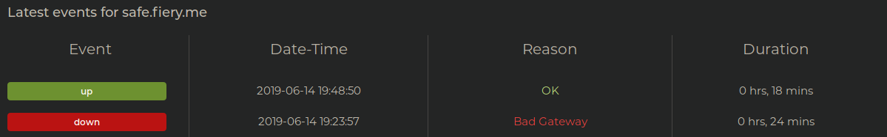

Uh yeah, this was due to me rebooting the server due to a recent kernel update.

After the update, I had to change some configuration to ClamAV daemon's systemd file because systemd's default timeout was 90s, while the daemon needed more time than that (we aren't exactly on that great of a server). It sorta took me a while to notice as well.

Sorry for the inconveniences!
