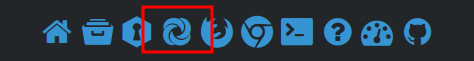

Hello there!

This is just another regular notice about the safe~

If you have not noticed, starting from commit [02e2e40](https://github.com/BobbyWibowo/lolisafe/commit/02e2e402c3718f3085e66aa7e650cbf7732c1dd3), the so-called "MASSIVE OVERHAUL", the safe now has temporary uploads!

As the name suggests, it makes your uploads be temporary, as in they will automatically be deleted from the server (duh).

Since it is not an _original feature_ of lolisafe, it is disabled by default.  
But you can easily configure it with our homepage's config tab:


As you can see from the small note underneath the "Save & Reload" button, some of the configurations will be applied to the ShareX config, which you can download by clicking on the ShareX icon in the homepage's footer.



The applied ones are precisely that temporary uploads feature (Upload Age), as well as the File Identifier Length option.

In the generated ShareX config, you will roughly see something like these in the `Headers` section:

```json
"Headers": {
  "token": "",
  "albumid": "",
  "filelength": "",
  "age": ""
}
```

If you have configured the Upload Age option to anything but the default value (Permanent), the `age` header will be filled. Internally, our server expects the value to be in the form of hours (e.i. `"1"` for 1 hour, or `"0.5"` for 30 minutes), so you will be seeing something like that.

As of right now, we only have: 15 minutes, 30 minutes, 1 hour, 6 hour, 12 hours, 1...7 days. These are worth noting because our server will not accept any values other than those I just mentioned. But instead of rejecting your uploads, should you have applied an unacceptable value, our server will simply assign the default age for the said uploads, which is the Permanent option.

This is roughly how it looks like after you uploaded something with our homepage uploader, with the Upload Age option enabled:


Another thing worth noting is that, your uploads may not be deleted at _exactly_ the same time as reported by the uploader. Internally, our server will query the files database every minute (this _may_ change in the future) to look for uploads that have passed their expiry date, only then will they be deleted.

So technically speaking, it may be off by up to a minute. But that is not technically correct either, since querying the database, unlinking the files from disk, updating the database, and sending API requests to Cloudflare to purge their caches, will definitely also take some time.

Anyway, you can be sure that the uploads will _eventually_ be deleted. There's also nothing stopping you from emailing me to manually delete anything, if necessary.

Back to the ShareX config file, if you have also configured the File Identifier Length option to anything but the default value (`4`), the `filelength` header will also be filled.

As for the `token` and `albumid` headers, those will only be added when you are currently logged in. The former will obviously be filled with your token (which you can re-generate in the dashboard, should you need to), while the latter will be filled with whichever album you currently have selected in the homepage (the "Upload to album" dropdown).

If you want to manually fill the `albumid` header, you can use the dashboard's "Manage your albums" menu to view the IDs of your albums.

So yeah, I guess that's all for today's blog post!

Thanks for attention~
