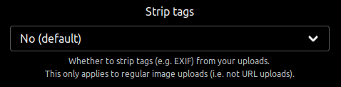

Another quick announcement that I've implemented tags stripping (e.g. EXIF) for image uploads in commit [d9ddfe8](https://github.com/BobbyWibowo/lolisafe/commit/d9ddfe8e9a087e7a5017ea843e6a0bfa806ef163).

I also implemented tags stripping for videos utilizing ffmpeg, but I'm not too confident that it'll always work as expected, so safe.fiery.me will not have it enabled as of yet.

However, other server owners who use the fork may choose to enable it and play around with it.

The option will also be applied to the downloadable ShareX config. Though I'm not sure if ShareX would attach any tags to its screenshots to begin with.

Anyway, that's all from me for today. See y'all next time.
