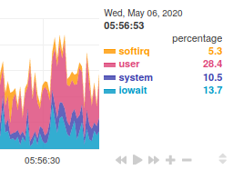

This is a continuation to my previous post, [Recent slow loading](recent-slow-loading) - Part 1.

---

In the previous post I claimed that the main reason of the overload was network bottleneck, but I was wrong. Sorry about that.

I initially assumed it was merely network bottleneck because Nginx Amplify (the previous analytics software I used) reported that CPU usage during the whole timespan of the overload was only ~50%.

It was likely a misconfiguration on my part that caused certain CPU utilizations to not be included in the charts, thus causing me to misunderstand the actual situation. Specifically, I did not include [iowait](https://serverfault.com/questions/12679/can-anyone-explain-precisely-what-iowait-is), among other things that I might have missed.

Before we go any deeper, I'd also like to mention that other than GoAccess that I mentioned in the previoust part, I also recently installed [Netdata](https://www.netdata.cloud/) for general server stats analytics.

GoAccess is a specialized software for analyzing web server's access logs, so it can't really let me analyze other things that are no less important. In this, Netdata comes to play.

So back to the CPU utilization thing, I noticed that by default Netdata would simply show all categories of CPU utilization with their pretty charts:

So I suddenly had a revelation, that perhaps, my CPU usages were never merely ~50% all along! The other half could have had all been occupied by iowait!

Thinking in that direction, it all started making much more sense. When the server was overloading, it was due to huge traffic to multiple large video files after all..

Plus, I mentioned that network traffic merely peaked at 256Mbps.. Our server's network bandwidth is a solid 1Gbps up and down.

So yeah.. that's all for the reflection season.

---

Still related to Netdata, from them I also learned about [QoS](https://learn.netdata.cloud/docs/agent/collectors/tc.plugin/#qos), and I had successfully set it up on the server as well.

In short, it can *shape and balance* network traffic.

Among other things, web server bandwidth will now be shared fairly to all visitors.

No more cases where certain visitors end up hogging most of the bandwidth while leaving only scraps to new visitors. In fact, newer visitors will be *favored* over previous ones if those people are still transferring data, so newer visitors will have a snappier experience.

Although it won't really help much if the ones that get overloaded are the CPU and all that anyway, but I think it's still a pretty good addition nonetheless.

I'm also thinking of setting up [SYNPROXY](https://learn.netdata.cloud/docs/agent/collectors/proc.plugin/#linux-anti-ddos), but I'll need a bit more time to study that one in details.

Anyway, that's all. See ya folks!
