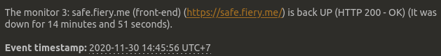

In short, I was tampering with some firewall rules, and accidentally locked myself out of the server.

Had to shutdown the server for a while, then boot into a rescue image, to fix the mistakes I did.

But yeah, problems solved, and everything should be back up and running.

Sorry for the inconveniences!
